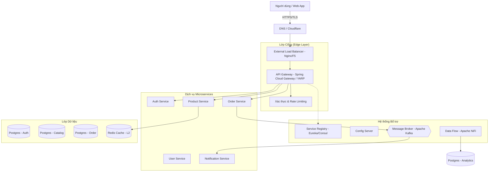

# Tài liệu Thiết kế Hệ thống (System Design Document) - NeoShop

Tài liệu này trình bày chi tiết thiết kế hệ thống cho NeoShop, một nền tảng thương mại điện tử hiện đại, đảm bảo các tiêu chuẩn cao về **hiệu năng (Performance)**, **khả năng mở rộng (Scalability)**, **tính sẵn sàng (Availability)** và **bảo mật (Security)**.

---

## 1. Mục tiêu và Yêu cầu Hệ thống

### 1.1. Yêu cầu Chức năng (Functional Requirements)

- Quản lý sản phẩm (Catalog), giỏ hàng và đặt hàng (Checkout).
- Quản lý người dùng, xác thực và phân quyền.
- Quản lý khóa kỹ thuật số (License keys).
- Hệ thống thông báo (Email, Push).
- Báo cáo và phân tích dữ liệu (Analytics).

### 1.2. Yêu cầu Phi chức năng (Non-functional Requirements)

- **Khả năng mở rộng (Scalability)**: Hệ thống phải chịu tải được hàng triệu người dùng đồng thời thông qua mở rộng theo chiều ngang (Horizontal Scaling).
- **Tính sẵn sàng cao (High Availability)**: Đảm bảo SLA 99.9%, không có điểm lỗi duy nhất (No Single Point of Failure).
- **Bảo mật**: Dữ liệu người dùng và thanh toán phải được mã hóa; hệ thống chống được các cuộc tấn công phổ biến (DDoS, SQL Injection).
- **Hiệu năng**: Thời gian phản hồi API (Latency) thấp (< 200ms cho các tác vụ thông thường).

---

## 2. Kiến trúc Tổng thể (High-Level Architecture)

Chúng ta sử dụng kiến trúc **Microservices** hướng sự kiện (**Event-Driven Architecture**).

---

## 3. Thành phần Chi tiết

### 3.1. API Gateway & Lớp Cổng

- **API Gateway**: Là điểm truy cập duy nhất. Thực hiện:
  - **Routing**: Phân luồng yêu cầu dựa trên PATH (ví dụ: `/api/v1/orders` -> Order Service).
  - **Authentication**: Xác thực JWT trước khi gửi yêu cầu vào bên trong.
  - **Rate Limiting**: Sử dụng cấu hình Redis để giới hạn ví dụ 10 req/s cho mỗi User.
- **Load Balancer (LB)**:
  - **External LB**: Thuật toán Round Robin hoặc Least Connections để phân phối tải lên các instance của Gateway.
  - **Internal LB**: Spring Cloud Load Balancer được cài đặt tại mỗi service để gọi dịch vụ khác thông qua danh sách từ Service Registry.

### 3.2. Lớp Dữ liệu (Data Layer)

- **Mẫu mỗi dịch vụ một cơ sở dữ liệu (Database per Service)**: Đảm bảo tính độc lập hoàn toàn.
- **Caching Strategy**:
  - **L1 Cache**: Tại mỗi instance service (In-memory).
  - **L2 Cache (Distributed)**: Sử dụng Redis để lưu các dữ liệu "nóng" như chi tiết sản phẩm, session người dùng.
- **Read/Write Splitting**: Sử dụng Read Replicas cho PostgreSQL để tối ưu hóa hiệu năng đọc (đặc biệt cho Product Catalog).

### 3.3. Giao tiếp giữa các Dịch vụ

- **Đồng bộ (Synchronous)**: Sử dụng gRPC hoặc REST (OpenFeign) cho các tác vụ cần phản hồi ngay.
- **Bất đồng bộ (Asynchronous)**: Sử dụng Apache Kafka.
  - Ví dụ: Khi đặt hàng thành công (`OrderPaid`), sự kiện sẽ được gửi vào Kafka để `Notification Service` gửi mail và `Product Service` cập nhật tồn kho mà không làm chậm quy trình thanh toán.

---

## 4. Thiết kế Khả năng Mở rộng và Chống lỗi (Resilience)

- **Service Registry (Eureka)**: Tự động phát hiện các instance mới được bật lên.
- **Circuit Breaker (Resilience4j/Polly)**: Khi một service bị lỗi (ví dụ Payment Gateway bên thứ 3 chậm), Circuit Breaker sẽ ngắt kết nối để tránh lỗi dây chuyền (Cascading Failure).
- **Auto-scaling**: Dựa trên CPU/Memory (Kubernetes HPA) để tự động tăng instance khi có khuyến mãi lớn.

---

## 5. Bảo mật Hệ thống

- **Zero Trust**: Mọi yêu cầu bên trong hệ thống vẫn cần có header xác thực giữa các service.
- **Data Encryption**:
  - **At Rest**: Mã hóa dữ liệu lưu trong DB (AES-256).
  - **In Transit**: Bắt buộc HTTPS (TLS 1.3).
- **Secret Management**: Không lưu mật khẩu/key trong code, sử dụng **HashiCorp Vault** hoặc **AWS Secrets Manager**.

---

## 6. Hạ tầng và Giám sát

- **Containerization**: Toàn bộ hệ thống chạy trên **Docker** và điều phối bởi **Kubernetes (K8s)**.
- **Logging (ELK Stack)**: Gom tất cả log từ các service về một nơi để tìm kiếm và gỡ lỗi.
- **Monitoring (Prometheus & Grafana)**: Theo dõi các chỉ số sức khỏe của máy chủ (CPU, RAM, Request per Second).

---

## 7. Quy trình Dữ liệu (Data Flow) - Ví dụ: Đặt hàng

1. **Client** gửi đơn hàng qua **Gateway**.
2. **Gateway** xác thực JWT và kiểm tra **Rate Limit**.
3. **Gateway** gửi yêu cầu đến **Order Service**.
4. **Order Service** gọi **Product Service** (đồng bộ) để kiểm tra tồn kho.
5. **Order Service** tạo đơn hàng trong **Order DB** và đẩy sự kiện vào **Kafka**.
6. **Notification Service** tiêu thụ sự kiện từ **Kafka** và gửi Email xác nhận cho khách.
