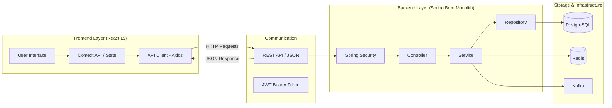

# Kiến trúc Hệ thống NeoShop

## 1. Tổng quan kiến trúc kết nối

Dự án sử dụng mô hình **Client-Server** thuần túy, trong đó Frontend và Backend hoàn toàn tách biệt, giao tiếp với nhau qua giao thức HTTP/HTTPS.

## 2. Luồng dữ liệu (Data Flow)

1.  **Request**: Người dùng thao tác trên UI -> React gửi API Request kèm theo JWT trong Header `Authorization: Bearer <token>`.
2.  **Authentication**: Spring Security chặn request, dùng `JwtAuthenticationFilter` để giải mã và xác thực token.
3.  **Processing**: Request được chuyển đến `Controller`, sau đó qua `Service` xử lý logic.
4.  **Database**: `Repository` sử dụng Hibernate/JPA để truy vấn Postgres.
5.  **Response**: Kết quả được `Controller` đóng gói vào `DTO` và trả về JSON cho Frontend.
6.  **Update UI**: Frontend nhận JSON và cập nhật trạng thái (State) để hiển thị dữ liệu mới.

## 3. Đặc điểm kỹ thuật

- **Stateless**: Backend không lưu Session (trạng thái đăng nhập) trong bộ nhớ, mọi thứ dựa vào JWT.
- **Decoupled**: Frontend có thể được deploy độc lập trên Vercel/Netlify, trong khi Backend chạy trên Docker/VPS.
- **Efficiency**: Sử dụng Redis để cache các dữ liệu nặng (như danh sách sản phẩm) nhằm giảm tải cho Database.
