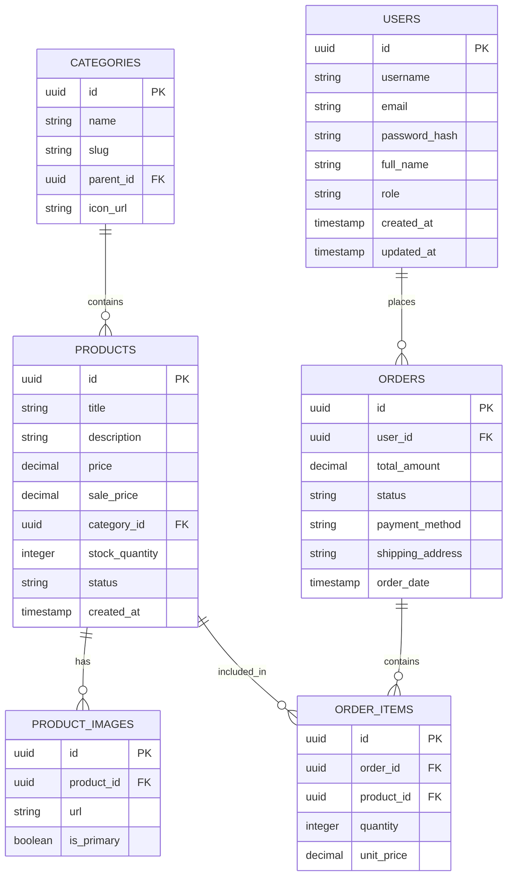

# Thiết kế Cơ sở dữ liệu: NeoShop

Hệ thống sử dụng một cơ sở dữ liệu **PostgreSQL** duy nhất (`neoshop`) với các bảng được tổ chức theo module chức năng.

## 1. Lược đồ tổng thể (Unified Schema)

## 2. Giải thích các Module

- **Authentication**: Lưu trữ thông tin định danh và phân quyền. Mật khẩu luôn được băm bằng thuật toán BCrypt.
- **Catalog**: Quản lý cây danh mục đa cấp và thông số sản phẩm. Hình ảnh được lưu trữ dưới dạng URL (trỏ đến S3 hoặc CDN).
- **Orders**: Lưu vết toàn bộ giao dịch. `ORDER_ITEMS` lưu `unit_price` tại thời điểm mua để tránh sai sót khi giá sản phẩm thay đổi sau này.

## 3. Quản lý Trạng thái (Enums)

- **User Role**: `ADMIN`, `USER`.
- **Product Status**: `ACTIVE` (Hiển thị), `INACTIVE` (Ẩn).
- **Order Status**: `PENDING` (Chờ xử lý), `PAID` (Đã thanh toán), `SHIPPED` (Đang giao), `COMPLETED` (Hoàn thành), `CANCELLED` (Đã hủy).
