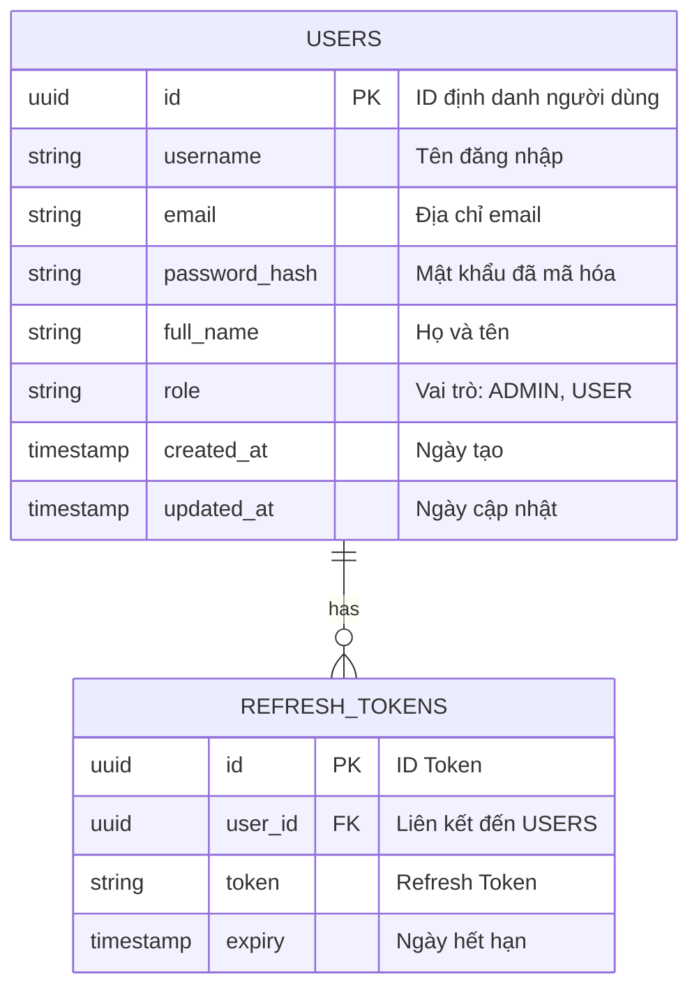
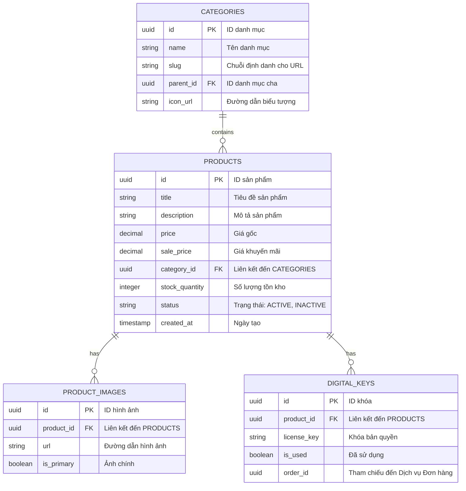
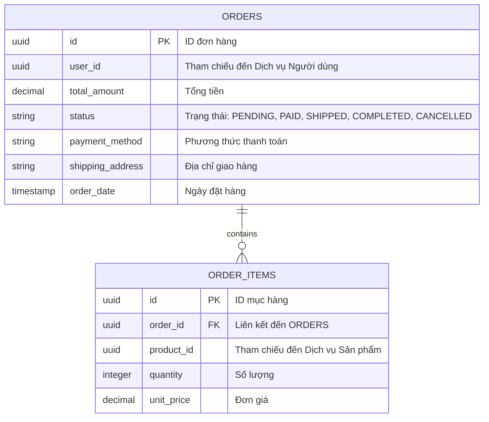
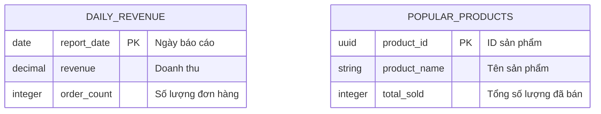

# Thiết kế Lược đồ Cơ sở dữ liệu: NeoShop

Vì chúng ta đang sử dụng **Kiến trúc Microservices**, mỗi dịch vụ sẽ có lược đồ cơ sở dữ liệu riêng để đảm bảo tính liên kết lỏng lẻo (loose coupling). Chúng ta sẽ sử dụng **PostgreSQL** làm cơ sở dữ liệu quan hệ chính.

## 1. Dịch vụ Người dùng/Xác thực (Cơ sở dữ liệu: `neoshop_user`)

## 2. Dịch vụ Sản phẩm (Cơ sở dữ liệu: `neoshop_catalog`)

## 3. Dịch vụ Đơn hàng (Cơ sở dữ liệu: `neoshop_order`)

## 4. Dịch vụ Phân tích (Cơ sở dữ liệu: `neoshop_analytics`)

_Lưu ý: Cơ sở dữ liệu này được tối ưu hóa cho các truy vấn đọc nhiều và tổng hợp dữ liệu._

---

## 5. Chiến lược Caching (Redis)

- **Chi tiết sản phẩm**: Khóa: `product:{id}`, thời hạn (TTL): 1 Giờ.
- **Cây danh mục**: Khóa: `categories:tree`, thời hạn (TTL): 24 Giờ (Xóa khi có thay đổi).
- **Phiên người dùng/Vai trò**: Khóa: `user:session:{token}`, thời hạn (TTL): 7 Ngày.
- **Bộ đếm tồn kho**: Khóa: `stock:{product_id}`, để kiểm tra tồn kho nhanh trước khi cập nhật DB.
